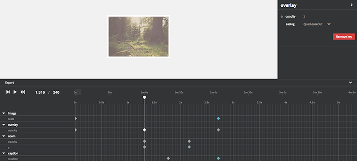

# TweenTime

## Demo

[Basic example](https://idflood.github.io/TweenTime/examples/basic.html)

[Grouping](https://idflood.github.io/TweenTime/examples/grouping.html)

[Advanced](https://idflood.github.io/TweenTime/examples/advanced.html)

## Usage

- Use shift key while dragging keys to snap them to existing one or to current time cursor.
- Use alt key while dragging keys to scale them.
- Click on a item label in the timeline to open the editor on the right. From there you can set values and add keys.
- Double click on a property timeline to add a key.

The API is relatively minimal and clearly not definitive now so there is no real documentation yet. But if you are curious check the code of the 2 exemples above.

## Another javascript timeline?

At first I created this for an internal project. But to be honest it is also to learn a bit more about d3js, play with some ideas and see where it goes. Hopefully this may be useful for someone else.

Some timeline libraries already exist and they may be a more appropriate choice for production use:

1. [Timeline.js](https://github.com/vorg/timeline.js) by Marcin Ignac
2. [Keytime Editor](https://github.com/mattdesl/keytime-editor/) by Matt DesLauriers
3. [Frame.js](https://github.com/mrdoob/frame.js/) by Ricardo Cabello
4. [timeliner](https://github.com/zz85/timeliner) by Joshua Koo

## So what are the differences?

- Heavy use of [d3.js](http://d3js.org/) to display the timeline.
- Use TimelineMax to update the values.
- Not meant to be lightweight, this explains the dependencies.
- Written in es6 and transpiled to es5 with 6to5.

## License

MIT, see [LICENSE.md](http://github.com/idflood/TweenTime/blob/master/LICENSE.md) for details.